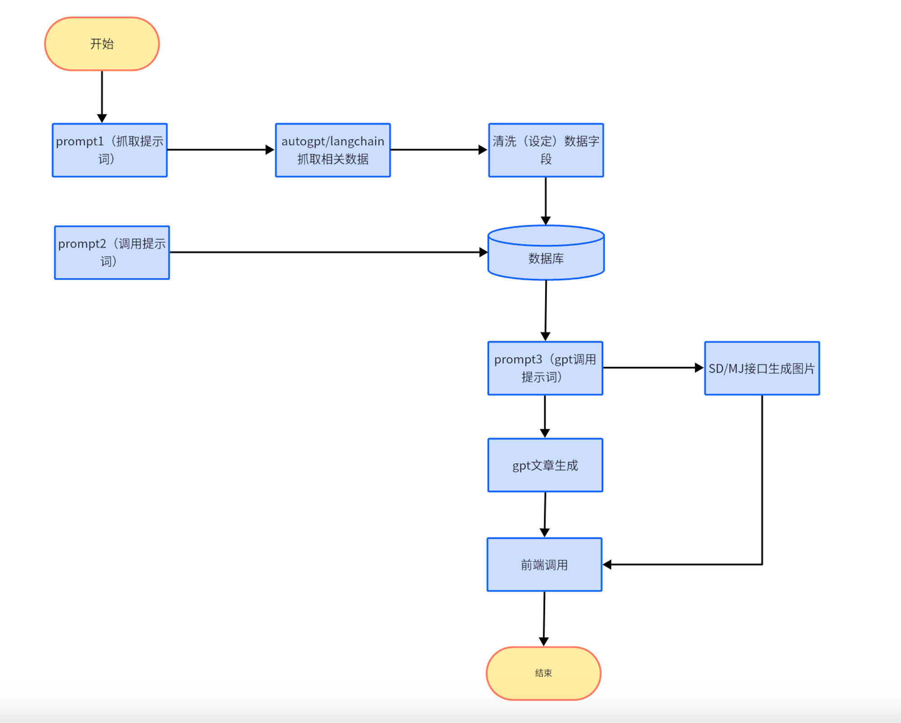

# 项目说明 

该项目提供生成特定主题相关的文章。
```
1、根据query prompt +渠道（包括不限于谷歌、reddit、Twitter等） 搜索内容 存放在数据库 采集不同的数据渠道 形成N种数据类型（不同渠道就是不同的数据类型）
2、根据1的内容+GPT4+summary-prompt1  通过不同的**summary- prompt1**（根据**summary- prompt1**生成报刊/杂志/评论等各种体裁）生成不同的类型的语料summary1（**要点** 大概100-200字）
3、根据2的内容+GPT4+summary-prompt 2 对第一次summary1进行生成的内容补充形成summary2 （**大纲** 大概200-500字）

4、根据3的内容+GPT4+generate prompt 生成终极文章（**完整文章** 大概1500-2500字）
5、根据4的内容+GPT4+generate prompt2 对终极进行语法和逻辑修正
6、对生成的文章，前端调用以后需要进行数据追踪
```

流程图：



## 配置
在 config.py 文件中配置相关参数，如 Google 搜索 API 密钥(https://serpapi.com/)、OpenAI API 密钥、数据库路径等


## 使用
Python的版本3.9   
使用前需要安装相应的依赖库，可以通过以下命令安装：
```
pip install -r requirements.txt
```

运行 main.py 文件。

生成数据和生成文章的示例：
```
python3 main.py --generate_data_query "amazon bussiness model"
python3 main.py --generate_article_query " Amazon was one of the first companies to offer same-day delivery, and it has since expanded its delivery options to include two-hour delivery, in-car delivery,"
```
如果查询特征网站的 在query之后加上:  site:website


demo:
```
python3 main.py --generate_data_query "Apple company business model"
```


http服务
```
启动服务： python server.py


请求入参示例：

POST /generate HTTP/1.1
Content-Type: application/json
{
    "generate_data_query": "你的query"
}
```


